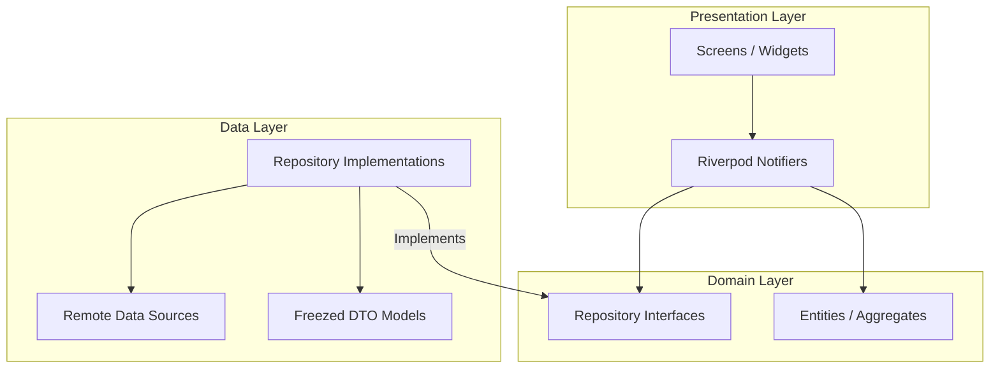

# Spondylus Mobile — Distributed Banking Client

This directory contains the mobile frontend application for **Spondylus** (Distributed Personal Finance System) built with **Flutter**.

---

## 🏛️ Architecture & Philosophy

The application strictly implements **Clean Architecture** organized by **Features (Feature-First)**. Each feature directory is divided into distinct layers following the dependency direction rule:

$$\text{Domain (pure Dart)} \longleftarrow \text{Data (DTOs, sources)} \longleftarrow \text{Presentation (Widgets, Notifiers)}$$



### Directory Slicing Structure
- **`lib/core/`**: Cross-cutting infrastructure concerns:
  - **`network/`**: Configured `Dio` HTTP client with `ClockInterceptor` (for Lamport logical clock synchronization) and `JwtInterceptor` (for secure auth injection).
  - **`router/`**: Declarative routing configured via `GoRouter`.
- **`lib/features/`**: Modular self-contained vertical slices of application logic:
  - `auth`: Phone and PIN login session authentication.
  - `accounts`: Bank account listing and balance aggregation.
  - `transactions`: Transfers and two-phase commit (2PC) operations.
  - `budget`: Spending limits and safe-to-spend estimations.
  - `reporting`: Netting engine tag reports.

---

## 🧪 Co-located Testing

To guarantee high code locality and simplify verification, **all tests must be placed in the same folder as the code they test**:

- Example directory structure:
  ```text
  lib/features/auth/domain/entities/
  ├── user.dart
  └── user_test.dart       <-- Co-located test file
  ```
- Test files must follow the pattern `*_test.dart`.
- Running tests is done by referencing the target directory:
  ```bash
  flutter test lib/
  ```

---

## ✍️ Coding Standards & Docstrings

- **Effective Dart:** Follow official guidelines. Use triple-slash doc comments (`///`) on all public APIs, methods, and classes.
- **Strict Formatting:** Run `flutter format` before committing.
- **Linting & Analysis:** Enforced via strict rules in `analysis_options.yaml` (including strict casts and strict type inferences). Verify checks via:
  ```bash
  flutter analyze
  ```
