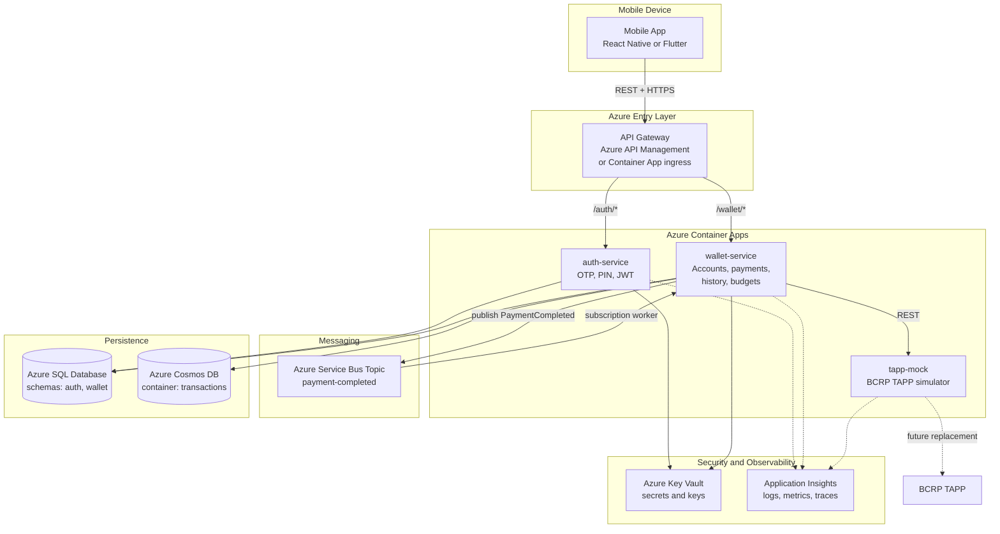

# Global Infrastructure Architecture

!!! note "Current MVP proposal"

    This document describes the current global infrastructure architecture for the
    Digital Wallet MVP. The design intentionally balances distributed-systems
    concepts with the constraints of a 6-week university project built by 5
    developers.

## 1. System Purpose

The application is a mobile personal finance aggregator. It allows users to:

- Sign up and authenticate with a phone number, OTP verification, and a personal
  4-6 digit PIN.
- Link bank accounts or wallets through the BCRP TAPP infrastructure. During the
  MVP, this dependency is represented by `tapp-mock`.
- Initiate payments from linked accounts without opening each bank or wallet app.
- Review categorized transaction history and manage basic budgets.

The application follows a payment initiation model. The user never shares banking
credentials with our system. Financial authentication, account ownership checks,
and consent are handled by TAPP or by the account provider behind TAPP. Our
platform only authenticates access to the app and stores the minimum data needed
to provide the wallet experience.

## 2. Architecture Decision

The selected MVP architecture is a small distributed system composed of:

- `auth-service`: user identity, OTP verification, PIN validation, and JWT issuing.
- `wallet-service`: account linking, payment initiation, transaction history, and
  budgets.
- `tapp-mock`: simulator for the future BCRP TAPP APIs.
- Azure Service Bus: asynchronous event transport for payment completion events.
- Azure SQL Database: relational data for users, linked accounts, budgets, and
  idempotency records.
- Azure Cosmos DB: transaction history and event-oriented records.

This is not a large microservices platform. It is a deliberately small service
split that demonstrates distributed-system principles while keeping the delivery
scope realistic.

### Why Not A Full Microservice Platform?

A complete microservice architecture would require service discovery,
independent databases per service, advanced networking, distributed secret
rotation, more CI/CD pipelines, and heavier operational monitoring. That would
be valuable in a production system, but it is too expensive for a 6-week MVP.

Instead, the project uses only the service boundaries that are useful for the
course and the product:

- Authentication is isolated because it has different security responsibilities.
- Wallet operations are grouped because account linking, payments, history, and
  budgets are tightly related in the MVP.
- TAPP is mocked as a separate container because it represents an external
  dependency and makes integration tests realistic.
- Asynchronous messaging is included only where it adds clear value: after a
  payment is completed.

## 3. High-Level Architecture



## 4. Component Responsibilities

| Layer | Component | Responsibility |
| --- | --- | --- |
| Client | Mobile app | User interface, secure local JWT storage, account and payment flows, optional QR reading. |
| Entry | API Gateway | Single public entry point, routing, basic rate limiting, request logging, initial JWT validation if available. |
| Identity | `auth-service` | User registration, OTP verification, PIN hashing, login, JWT issuing, token validation metadata. |
| Wallet | `wallet-service` | Account linking, TAPP integration, payment initiation, budgets, transaction history, event publication. |
| External simulation | `tapp-mock` | Simulated TAPP consent, account, alias, payment, and confirmation responses. |
| Messaging | Azure Service Bus | Topic-based delivery of `PaymentCompleted` events. |
| Relational storage | Azure SQL Database | ACID data: users, linked accounts, consent references, budgets, categories, idempotency. |
| Document storage | Azure Cosmos DB | Transaction records, payment events, audit-like operational history. |
| Secrets | Azure Key Vault | JWT signing keys, connection strings, TAPP mock credentials, encryption keys. |
| Observability | Application Insights | Centralized logs, metrics, request traces, dependency traces, and error analysis. |

## 5. Infrastructure Scope For The MVP

### Azure Container Apps

Azure Container Apps is the preferred runtime because it gives the project a
container-based distributed deployment without requiring the team to operate AKS.
It supports revisions, managed ingress, environment variables, scale rules, and
integration with Azure Container Registry.

For the MVP, deploy three containers:

- `auth-service`
- `wallet-service`
- `tapp-mock`

Each service should expose a health endpoint:

- `GET /health/live` for process liveness.
- `GET /health/ready` for dependency readiness.

### API Gateway

Two options are acceptable for the MVP:

- **Preferred if time allows:** Azure API Management, because it provides
  managed routing, rate limiting, and API documentation support.
- **Simpler option:** Azure Container Apps ingress with a lightweight gateway or
  reverse proxy route configuration.

The gateway should route:

| Route prefix | Destination |
| --- | --- |
| `/auth/*` | `auth-service` |
| `/wallet/*` | `wallet-service` |
| `/tapp-mock/*` | `tapp-mock` only in development or testing environments |

The gateway should not contain business logic. Its job is routing, basic
protection, and visibility.

### Azure SQL Database

Use one Azure SQL Database instance with separate schemas:

- `auth`: users, OTP attempts, PIN hash metadata, session metadata if needed.
- `wallet`: linked accounts, TAPP consent references, budgets, categories,
  idempotency keys, and payment request records.

This is a pragmatic compromise. A strict microservice architecture would give
each service its own database. For this MVP, one database lowers cost and setup
time while still preserving boundaries through schemas and service-owned tables.

### Azure Cosmos DB

Use Cosmos DB for transaction history because transactions are naturally
document-shaped and are commonly retrieved by user and date range.

Recommended container:

| Container | Partition key | Main use |
| --- | --- | --- |
| `transactions` | `/userId` | User transaction history, payment events, category snapshots. |

Keep documents denormalized enough for mobile screens. For example, store the
category name and merchant label at the time of the transaction, not only their
foreign keys.

### Azure Service Bus

Use a topic named `payment-completed`. The topic allows the team to demonstrate
publish-subscribe without adding multiple workers too early.

Initial subscriptions:

| Subscription | Consumer | Purpose |
| --- | --- | --- |
| `wallet-history` | `wallet-service` background worker | Store or enrich the transaction history. |
| `wallet-budget` | `wallet-service` background worker | Update budget consumption after payment completion. |

Both workers may live inside `wallet-service` during the MVP. This preserves the
distributed messaging concept without creating unnecessary services.

### Key Vault

Store secrets and keys in Azure Key Vault:

- JWT signing key or RSA private key.
- Database connection strings.
- Cosmos DB connection details.
- Service Bus connection string, unless Managed Identity is used.
- TAPP mock credentials or future TAPP credentials.

For local development, use user secrets or environment variables. Do not commit
secrets to the repository.

### Application Insights

All services should send logs, metrics, and traces to Application Insights.
Minimum useful telemetry:

- Request duration and status code.
- Dependency calls to SQL, Cosmos DB, Service Bus, and `tapp-mock`.
- Correlation ID per request.
- Business event logs for login, account linking, payment requested, payment
  completed, and budget updated.

## 6. Main Runtime Flows

### 6.1 Registration And Login

1. The mobile app sends the phone number to `POST /auth/register` or
   `POST /auth/login/start`.
2. `auth-service` generates an OTP and stores a short-lived OTP challenge.
3. The user submits the OTP.
4. The user creates or enters the PIN.
5. `auth-service` verifies the PIN using a password hashing algorithm such as
   bcrypt or Argon2id.
6. `auth-service` returns a signed JWT.
7. The mobile app stores the JWT using secure storage.

### 6.2 Account Linking

1. The mobile app calls `wallet-service` through the gateway.
2. `wallet-service` validates the JWT.
3. `wallet-service` creates a consent request against `tapp-mock`.
4. `tapp-mock` returns a simulated authorization result.
5. `wallet-service` stores the linked account reference and consent metadata in
   SQL.

In the real TAPP integration, this flow will likely involve redirect or
decoupled authorization. The MVP keeps the same conceptual boundary but replaces
the external dependency with deterministic mock responses.

### 6.3 Payment Initiation And History Update

1. The user initiates a payment from the mobile app.
2. `wallet-service` validates the request, the JWT, and the idempotency key.
3. `wallet-service` calls `tapp-mock` to simulate payment execution.
4. `wallet-service` records the payment result.
5. `wallet-service` publishes `PaymentCompleted` to Azure Service Bus.
6. A background worker consumes the event.
7. The worker stores the transaction in Cosmos DB and updates budget progress in
   SQL.

This flow demonstrates both synchronous communication and asynchronous
processing.

## 7. Security Model

### User Authentication

The app-level authentication flow uses:

- Phone number as the user identifier.
- OTP for registration or login verification.
- PIN for day-to-day login.
- JWT for API authorization.

PINs must never be stored directly. Store only a strong hash with salt and
reasonable work factor.

### JWT Strategy

For the MVP, two JWT signing options are acceptable:

- **HS256 shared secret:** faster to implement, but requires careful secret
  sharing between services.
- **RS256 asymmetric keys:** better separation, because `auth-service` signs with
  a private key and other components validate with a public key.

Recommended MVP choice: RS256 if the team can implement it without blocking the
schedule; otherwise HS256 stored in Key Vault is acceptable for the university
prototype.

### Service-To-Service Security

For production, service-to-service communication should use Managed Identity,
mTLS, or internal tokens. For the MVP:

- Keep services inside the same Container Apps environment.
- Avoid exposing internal services publicly when possible.
- Validate JWTs in `wallet-service`, not only at the gateway.
- Use Key Vault for secrets.

### Sensitive Data

The platform must not store bank passwords, banking credentials, card numbers, or
raw financial authentication factors. TAPP access tokens or consent tokens, even
in mock form, should be treated as sensitive and encrypted or stored through
secure configuration.

## 8. Recommended Design Patterns

### API Gateway Pattern

Use a gateway as the public entry point. This keeps mobile clients from needing
to know every internal service URL and gives the team one place for routing,
rate limits, and request tracing.

### Anti-Corruption Layer

Wrap all TAPP calls behind a `TappClient` interface inside `wallet-service`. The
wallet domain should not depend directly on mock response shapes or future BCRP
contract changes.

Recommended structure:

```text
wallet-service/
  Application/
  Domain/
  Infrastructure/
    Tapp/
      TappClient.cs
      TappMockClient.cs
      TappDtos.cs
```

### Publish-Subscribe

Use Service Bus topics for payment completion events. This allows future
features, such as notifications or reconciliation, to subscribe without changing
the payment initiation flow.

### Idempotency

Every payment, account-linking operation, and refund-like action should include
an idempotency key. Store processed keys in SQL with the original request hash
and response summary. This prevents duplicate payments caused by retries or
mobile network issues.

### Repository Pattern

Use repositories for SQL and Cosmos DB access where they simplify testing and
keep business logic away from persistence details. Avoid creating generic
repositories for everything; use focused repositories such as:

- `UserRepository`
- `LinkedAccountRepository`
- `PaymentRequestRepository`
- `BudgetRepository`
- `TransactionHistoryRepository`

### Unit Of Work For SQL Operations

When one use case changes multiple SQL tables, commit them in one transaction.
For example, creating a linked account and storing its consent metadata should be
atomic.

### Background Worker Pattern

Use a hosted background worker in `wallet-service` to consume Service Bus
messages. This is enough for the MVP and avoids creating another deployable
service too early.

### Retry With Backoff And Circuit Breaker

External calls to `tapp-mock` and future TAPP APIs should use:

- Short timeouts.
- Retry with exponential backoff for transient failures.
- Circuit breaker for repeated failures.

In .NET, this can be implemented with `HttpClientFactory` and Polly.

## 9. Engineering Best Practices

### API Practices

- Use explicit request and response DTOs.
- Validate requests at the boundary.
- Return consistent error responses.
- Include `X-Correlation-Id` in every request and response.
- Require idempotency keys for payment-like operations.
- Version external APIs with a prefix such as `/api/v1`.

### Data Practices

- Keep `auth-service` as the only writer of `auth` schema tables.
- Keep `wallet-service` as the only writer of `wallet` schema tables.
- Do not store secrets in SQL.
- Store transaction history in Cosmos DB by `userId` partition.
- Keep audit-relevant timestamps in UTC.

### Observability Practices

- Log structured data, not long free-form messages.
- Never log PINs, OTPs, JWTs, access tokens, or secrets.
- Add correlation IDs to logs and Service Bus messages.
- Track dependency failures separately from business validation failures.

### Testing Practices

The MVP should include a small but useful test suite:

- Unit tests for PIN hashing, JWT issuing, budget calculations, and category
  assignment.
- Integration tests for `wallet-service` against `tapp-mock`.
- Contract tests for the most important TAPP mock endpoints.
- Basic smoke tests in CI for service startup and health endpoints.

### CI/CD Practices

GitHub Actions should run:

1. Restore dependencies.
2. Build services.
3. Run tests.
4. Build container images.
5. Push images to Azure Container Registry.
6. Deploy to Azure Container Apps.

For the university MVP, one development environment and one final demo
environment are enough.

## 10. MVP Delivery Plan

| Week | Focus | Expected result |
| --- | --- | --- |
| 1 | Project setup, CI/CD skeleton, infrastructure baseline | Container Apps environment, ACR, basic deploy, service templates. |
| 2 | `auth-service` | Registration, OTP simulation or provider integration, PIN setup, JWT login. |
| 3 | `tapp-mock` and account linking | Mock consent/account APIs, linked account storage, mobile account screen. |
| 4 | Payment initiation | Payment endpoint, idempotency, mock payment execution, basic payment UI. |
| 5 | Async processing and finance features | Service Bus event, transaction history, budget updates, categorization. |
| 6 | Hardening and final demo | Tests, observability, documentation, deployment cleanup, presentation. |

## 11. Trade-Offs And Constraints

| Decision | Benefit | Cost or limitation |
| --- | --- | --- |
| Two core services instead of many | Lower coordination cost for 5 developers. | Less granular service ownership. |
| One SQL database with schemas | Faster setup and lower cost. | Not a strict database-per-service model. |
| `wallet-service` owns multiple wallet features | Simpler MVP delivery. | Future extraction may be needed. |
| Worker inside `wallet-service` | Fewer containers to deploy. | Worker scaling is tied to wallet service scaling. |
| TAPP mock first | Enables development without public BCRP APIs. | Contracts must be updated when official APIs are available. |
| Optional API Management | Better gateway features. | May be skipped if setup time becomes risky. |

## 12. Future Evolution

After the MVP, the architecture can evolve gradually:

1. Replace `tapp-mock` with the real TAPP integration.
2. Split the wallet background worker into a separate `finance-worker`.
3. Add a notification service subscribed to `payment-completed`.
4. Move from shared SQL schemas to separate databases if service ownership grows.
5. Add stronger service-to-service authentication with Managed Identity or mTLS.
6. Add OpenAPI documentation and automated contract validation in CI.

The key principle is incremental evolution. The MVP should prove the product
flows and distributed architecture concepts without building infrastructure that
the team cannot maintain within the course timeline.
