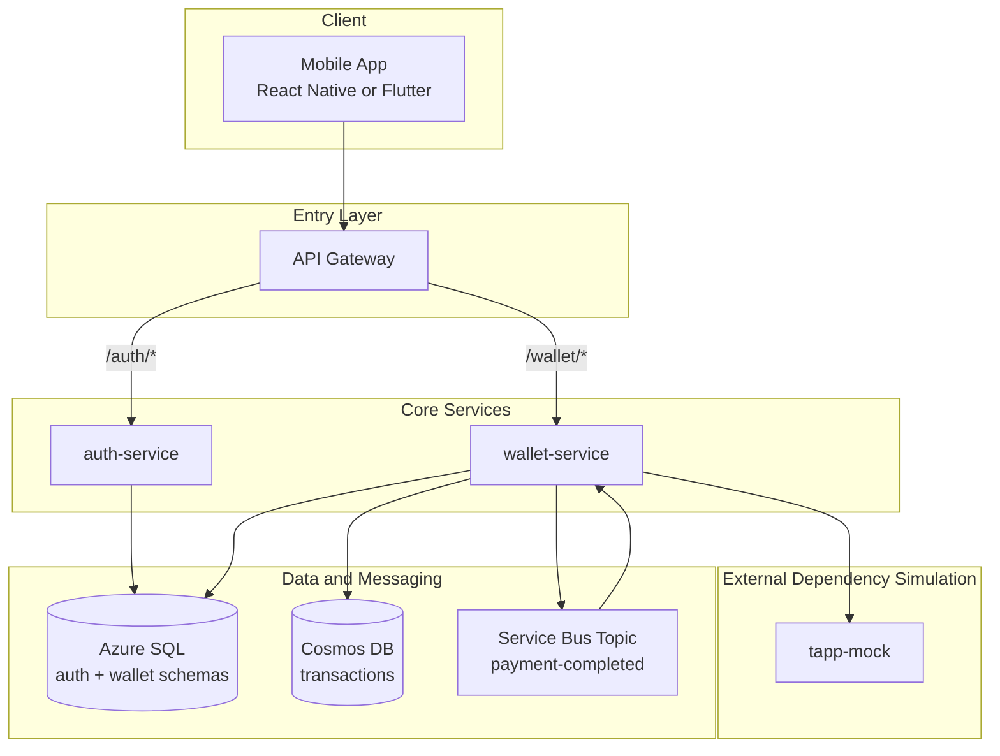

# Services Architecture

!!! note "Current MVP service model"

    The service model uses two core backend services and one external-system
    simulator. This is enough to demonstrate distributed communication,
    independent deployment, asynchronous messaging, and service ownership without
    overloading a 5-person team during a 6-week MVP.

## 1. Service Overview



## 2. `auth-service`

`auth-service` owns application identity. It does not know about payments,
budgets, linked accounts, or TAPP business rules.

### Responsibilities

- Register users by phone number.
- Generate and verify OTP challenges.
- Store PIN hashes using bcrypt or Argon2id.
- Authenticate users with phone number, OTP, and PIN.
- Issue signed JWTs for the mobile app.
- Expose token validation metadata if RS256 is used.
- Store identity-related data in the `auth` schema.

### Recommended Endpoints

| Endpoint | Purpose |
| --- | --- |
| `POST /auth/register/start` | Start phone registration and OTP challenge. |
| `POST /auth/register/verify` | Verify OTP and create the user record. |
| `POST /auth/pin/setup` | Store the user's PIN hash after OTP verification. |
| `POST /auth/login` | Validate phone and PIN, then issue JWT. |
| `GET /auth/.well-known/jwks.json` | Optional public keys for RS256 JWT validation. |
| `GET /auth/health/live` | Liveness check. |
| `GET /auth/health/ready` | Readiness check. |

### Data Ownership

`auth-service` is the only writer for:

- `auth.users`
- `auth.otp_challenges`
- `auth.pin_credentials`
- `auth.login_attempts`

Other services should not write to these tables. If they need user information,
they should use claims from the JWT or a small read endpoint.

## 3. `wallet-service`

`wallet-service` owns the financial experience of the app. It coordinates linked
accounts, payment initiation, transaction history, and budgets.

### Responsibilities

- Validate JWTs on protected routes.
- Link accounts through the TAPP integration boundary.
- Store linked account references and consent metadata.
- Validate idempotency keys for payment-like operations.
- Initiate payments through `tapp-mock` during the MVP.
- Publish `PaymentCompleted` events to Service Bus.
- Consume payment events through internal background workers.
- Store transaction history in Cosmos DB.
- Update budget progress in Azure SQL.

### Recommended Endpoint Groups

| Endpoint group | Purpose |
| --- | --- |
| `POST /wallet/accounts/link` | Start or simulate account linking. |
| `GET /wallet/accounts` | List linked accounts. |
| `GET /wallet/accounts/{accountId}/balance` | Return cached or mock balance data. |
| `POST /wallet/payments` | Initiate a payment. |
| `GET /wallet/payments/{paymentId}` | Check internal payment status. |
| `GET /wallet/transactions` | Query transaction history. |
| `POST /wallet/budgets` | Create a budget. |
| `GET /wallet/budgets` | List budgets and progress. |
| `GET /wallet/health/live` | Liveness check. |
| `GET /wallet/health/ready` | Readiness check. |

### Internal Modules

Although `wallet-service` is one deployable service, it should be internally
modular:

```text
wallet-service/
  Accounts/
  Payments/
  Transactions/
  Budgets/
  TappIntegration/
  Messaging/
  Shared/
```

This structure keeps the code understandable and makes future extraction easier.

## 4. `tapp-mock`

`tapp-mock` represents the external BCRP TAPP platform during development and
testing. It should be deterministic, documented, and easy to reset.

### Responsibilities

- Simulate OAuth/token responses if needed.
- Simulate consent creation and authorization.
- Simulate linked account and balance responses.
- Simulate alias validation.
- Simulate payment execution and confirmation.
- Return realistic success and failure cases.

### Recommended Mock Endpoints

| Endpoint | Purpose |
| --- | --- |
| `POST /tapp-mock/auth/oauth/token` | Simulate TAPP token issuing. |
| `POST /tapp-mock/consents` | Simulate consent creation. |
| `POST /tapp-mock/accounts` | Simulate balance or transaction query. |
| `POST /tapp-mock/aliases/validate` | Simulate TAPP ID validation. |
| `POST /tapp-mock/payments` | Simulate payment execution. |
| `POST /tapp-mock/payments/status` | Simulate payment status query. |

### Design Recommendation

`wallet-service` should never depend directly on controller classes or internal
types from `tapp-mock`. It should communicate over HTTP through a `TappClient`
interface. This keeps the mock replaceable when the real BCRP API becomes
available.

## 5. Communication Patterns

| Source | Destination | Mechanism | Notes |
| --- | --- | --- | --- |
| Mobile app | API Gateway | HTTPS/REST | Public client communication. |
| API Gateway | `auth-service` | HTTPS/REST | Authentication routes. |
| API Gateway | `wallet-service` | HTTPS/REST | Protected wallet routes. |
| `wallet-service` | `tapp-mock` | HTTP/REST | External dependency simulation. |
| `wallet-service` | Service Bus | Publish event | Payment completion event. |
| Service Bus | `wallet-service` worker | Subscription | History and budget updates. |
| Services | Azure SQL | SQL connection | Relational persistence. |
| `wallet-service` | Cosmos DB | SDK/API | Transaction history persistence. |

## 6. Event Design

### `PaymentCompleted`

The `PaymentCompleted` event is published after `wallet-service` receives a
successful payment result from `tapp-mock`.

Recommended event shape:

```json
{
  "eventId": "evt-20260608-001",
  "eventType": "PaymentCompleted",
  "occurredAt": "2026-06-08T20:15:00Z",
  "correlationId": "corr-abc-123",
  "userId": "usr-123",
  "paymentId": "pay-456",
  "sourceAccountId": "acc-001",
  "destinationAlias": "merchant@example.tapp",
  "amount": {
    "value": 85.5,
    "currency": "PEN"
  },
  "categoryHint": "Food",
  "providerTransactionId": "TAPP-PAY-987654321"
}
```

### Event Handling Rules

- Event consumers must be idempotent.
- Store processed `eventId` values or derive idempotency from `paymentId`.
- Preserve `correlationId` for tracing.
- Do not include secrets, JWTs, OTPs, or TAPP access tokens in events.
- If processing fails, let Service Bus retry and then move the message to a
  dead-letter queue.

## 7. Recommended Implementation Patterns

### Layered Service Structure

Each service should separate:

- API controllers or minimal API endpoints.
- Application use cases.
- Domain rules.
- Infrastructure adapters.
- Persistence models.

This prevents controllers from becoming the place where all business logic lives.

### Dependency Injection

Use dependency injection for:

- Repositories.
- HTTP clients.
- Clock/time provider.
- JWT services.
- TAPP client.
- Service Bus publisher and consumers.

This makes the code testable and allows the team to replace real dependencies
with test doubles.

### DTO Mapping

Use explicit DTOs for external API requests and responses. Do not expose database
entities directly through HTTP endpoints.

### Idempotent Commands

Payment initiation and account linking should behave like idempotent commands.
If the mobile app retries the same command, the backend should return the same
result instead of creating a duplicate payment.

### Resilient HTTP Client

Calls from `wallet-service` to `tapp-mock` should use a typed HTTP client with:

- Timeout.
- Retry for transient failures.
- Correlation ID propagation.
- Structured logging.

For .NET, `IHttpClientFactory` plus Polly is a good fit.

### Background Processing

Use `.NET BackgroundService` or an equivalent hosted worker inside
`wallet-service` to process Service Bus subscriptions. This keeps deployment
small while still demonstrating asynchronous processing.

## 8. Service Boundaries

The MVP should avoid accidental coupling:

- `auth-service` should not call `wallet-service`.
- `wallet-service` should not write to `auth` tables.
- `tapp-mock` should not access production application databases.
- The mobile app should not call `tapp-mock` directly.
- Service Bus messages should carry event data, not database entities.

## 9. Failure Handling

### Authentication Failures

- Limit OTP verification attempts.
- Limit PIN attempts.
- Return generic error messages that do not reveal whether a phone number exists.

### Payment Failures

- Persist the payment request before calling TAPP.
- Store the final status returned by `tapp-mock`.
- Use idempotency keys to avoid duplicate payment execution.
- Return clear user-facing states: `PENDING`, `SUCCEEDED`, `FAILED`.

### Messaging Failures

- Configure retry policies on Service Bus subscriptions.
- Use a dead-letter queue for messages that cannot be processed.
- Log the failure with correlation ID and event ID.
- Provide a simple manual replay strategy for the demo.

## 10. Testing Strategy

| Test type | Target | MVP expectation |
| --- | --- | --- |
| Unit tests | PIN hashing, JWT, budget calculations, categorization | Required for critical logic. |
| Integration tests | `wallet-service` to `tapp-mock` | Required for account linking and payment flows. |
| Contract tests | TAPP mock request/response shapes | Useful to keep docs and implementation aligned. |
| Smoke tests | Health endpoints and basic startup | Required in CI. |
| Manual demo tests | Mobile-to-backend happy paths | Required before final presentation. |

## 11. Practical Team Split

For 5 developers, a realistic ownership model is:

| Role | Main ownership |
| --- | --- |
| Developer 1 | `auth-service` and JWT/security flow. |
| Developer 2 | `wallet-service` account linking and TAPP client. |
| Developer 3 | Payments, Service Bus event publishing, idempotency. |
| Developer 4 | Transaction history, budgets, Cosmos DB, event consumers. |
| Developer 5 | Mobile app, API integration, CI/CD support, demo flows. |

These roles can overlap, but each area has a clear primary owner.

## 12. Future Extraction Candidates

If the project grows after the MVP, the first candidates for extraction are:

- `finance-worker`: independent worker for categorization, budgets, and reports.
- `notification-service`: push notifications or email notifications.
- `tapp-adapter-service`: dedicated boundary for the real TAPP integration.

Do not extract these during the MVP unless the implementation becomes clearly
blocked by the current structure.
