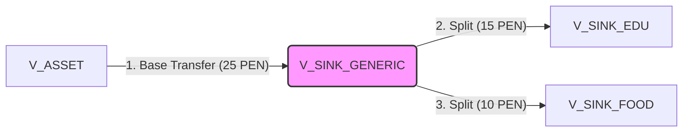
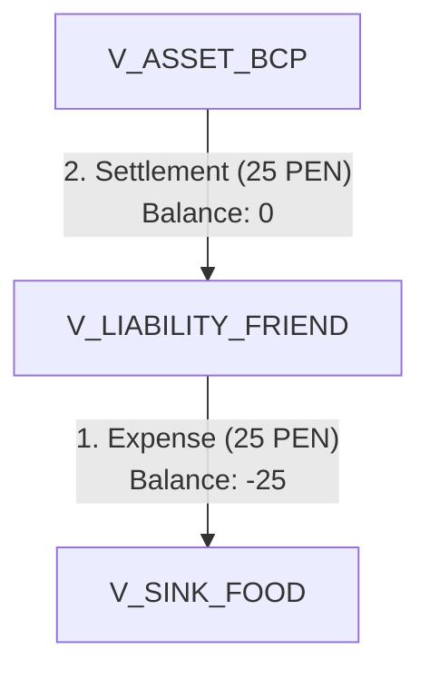
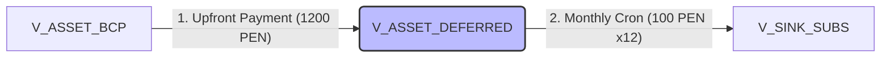

# Core logic

!!! note This is not the proposed implementation
The next section describes the original idea, but the implemented part is
[here](Programatic_part.md)

The system architecture is based on a mathematical model of a directed graph and
bitemporal double-entry accounting. This structure guarantees immutability,
external traceability (BCRP), and separation of concerns.

To address concerns regarding data duplication: the system prevents duplication
using the **Zero-Sum Flow** principle.

---

## Core Architecture & Philosophy

The entire ecosystem is mathematically modeled as a directed graph $G = (V, E)$.

- **Nodes ($V$):** Represent entities that hold or classify value.
- **Vectors ($E$):** Represent the sole mechanism for moving value between nodes.

The ledger history is strictly **append-only** to ensure full mathematical auditability.

---

## Core Data Structures

### `Node`

Centralizes financial actors. Once created, its currency is immutable. The mathematical behavior of a node depends entirely on its type:

- **`ASSET` (Real / Tangible):** Represents tangible money or physical bank accounts. A positive balance indicates available liquidity. An outgoing vector from this node reduces your real money.
- **`LIABILITY` (Virtual / Debt):** Represents debts, credit lines, or informal loans. It functions bidirectionally:
    - A **negative balance** (more value left than entered) means _you owe money_ to this node.
    - A **positive balance** means _the node owes money to you_ (a loan receivable).
- **`SOURCE` (Origin):** Represents the external environment from which money enters the system (e.g., Salary, Investment Yields). In graph mathematics, these nodes only emit vectors, meaning their global balance will always be negative (they supplied value to the system).
- **`SINK` (Destination / Category):** Represents the external environment where money leaves the system (e.g., Food, Rent). These nodes act as expense categories where budgets are evaluated. Their balance will always be positive (accumulating spent value).

| Field      | Description                                                                |
| :--------- | :------------------------------------------------------------------------- |
| `id`       | Primary key.                                                               |
| `user_id`  | Owner of the node (multi-tenancy isolation).                               |
| `name`     | Display name (e.g., `"BCP Account"`, `"Food"`, `"Salary"`, `"Juan Debt"`). |
| `type`     | `ASSET`, `LIABILITY`, `SOURCE`, `SINK`.                                    |
| `currency` | Immutable (e.g., `PEN`, `USD`).                              |

### `Vector`

An immutable mechanism for financial mutation.

| Field            | Description                                                         |
| :--------------- | :------------------------------------------------------------------ |
| `id`             | Primary key.                                                        |
| `user_id`        | Owner of the transaction.                                           |
| `source_node_id` | Node where funds originate ($u$).                                   |
| `target_node_id` | Node where funds arrive ($v$).                                      |
| `amount`         | Absolute value extracted from the source node ($a > 0$).            |
| `exchange_rate`  | Multiplier to convert source to target currency. Default: `1.0`.    |
| `effective_at`   | Logical time ($t_{eff}$). Used for budget and balance calculations. |
| `system_at`      | Physical time ($t_{sys}$). Used for audit logs.                     |
| `status`         | `PENDING`, `COMPLETED`, `FAILED`.                                   |
| `external_ref`   | Idempotency key or external BCRP reference ID.                      |

### `Budget_Constraint`

A passive evaluation rule applied temporally to a `SINK` node.

| Field            | Description                                        |
| :--------------- | :------------------------------------------------- |
| `id`             | Primary key.                                       |
| `target_node_id` | Reference to a `SINK` node.                        |
| `limit_amount`   | Maximum permitted value flow within the timeframe. |
| `start_date`     | Beginning of the evaluation period.                |
| `end_date`       | End of the evaluation period.                      |

### `Automation_Rule`

An active engine for background tasks and scheduled actions (Cron).

| Field          | Description                                            |
| :------------- | :----------------------------------------------------- |
| `id`           | Primary key.                                           |
| `user_id`      | Owner of the rule.                                     |
| `trigger_cron` | Cron expression (e.g., `0 0 1 * *`).                   |
| `action_type`  | `CREATE_BUDGET` (Rollovers), `EMIT_VECTOR` (Accruals). |
| `payload`      | Dynamic parameters for the action execution.           |
| `last_run`     | Last successful execution timestamp.                   |

---

## Abstract Operations

Business logic operates at two distinct levels: fundamental operations and derived operations.

### Fundamental Operations

1. **`Transfer(source_id, target_id, amount, rate, effective_date, ref)`**
   Inserts a single record into the `Vector` table. This is the **only** valid mechanism to shift value within the system.
2. **`EvaluateState(node_id, start_date, end_date)`**
   Calculates the dynamic balance of any given node by resolving the following equation in real-time:

$$
\text{Balance}(v) = \sum_{e \in E_{\text{in}}(v)} \big( e.\text{amount} \times e.\text{exchange\_rate} \big) - \sum_{e \in E_{\text{out}}(v)} e.\text{amount}
$$

### Derived Operations (Composition Logic)

These operations do not modify historical vectors nor do they execute `UPDATE` statements. Instead, they are composed by executing multiple `Transfer` actions designed to "drain" a generic temporary node.

1. **`Reclassify(original_vector, new_target_id)`**
   Corrects a categorization error. If the `original_vector` moved funds into a generic temporary node, this function executes a new `Transfer` moving the funds directly from the generic node to the `new_target_id`.
    - _Duplication Prevention:_ The generic node receives $+X$ and subsequently emits $-X$. Its net balance during `EvaluateState` yields exactly $0$.

2. **`SplitTransfer(original_vector, splits_array)`**
   Fractions a single payment. It executes multiple `Transfer` operations from the generic temporary node to various destination nodes. The backend strictly enforces the invariant:
   $$\sum a_{split} = a_{original}$$

---

## 4. Use Case Flows

---

### Deferred and Fractioned Organization (Split Transaction)

_The user pays 25 PEN. The bank confirms the transaction._

1. **Base Transfer:** The system executes a base `Transfer`: $V_{\text{ASSET}} \to V_{\text{SINK\_GENERIC}}$ (25 PEN). Generic Balance becomes $+25$.
2. **Splitting:** The user categorizes the expense later at home (15 Education, 10 Food).
3. **Derived Vectors:** The system executes `SplitTransfer`, emitting two derived vectors:
   * $V_{\text{SINK\_GENERIC}} \to V_{\text{SINK\_EDU}}$ (15 PEN).
   * $V_{\text{SINK\_GENERIC}} \to V_{\text{SINK\_FOOD}}$ (10 PEN).
4. **Result (`EvaluateState`):** Generic Node balance $= 25 - 15 - 10 = 0$. Budgets are correctly impacted. No data duplication occurs. The original BCRP vector remains untouched as an immutable audit trail.

---

### Informal Loan (A friend pays your 25 PEN bill)

1. **Expense:** `Transfer` from $V_{\text{LIABILITY\_AMIGO}} \to V_{\text{SINK\_FOOD}}$ (25 PEN). Your budget records 25 spent. Your friend's node balance drops to $-25$ (indicating you owe them money).
2. **Settlement:** `Transfer` from $V_{\text{ASSET\_BCP}} \to V_{\text{LIABILITY\_AMIGO}}$ (25 PEN). Your real bank account decreases by 25. Your friend's balance returns to $0$.

---

### Monthly Cumulative Budget (Rollover)

1. An `Automation_Rule` triggers on Day 1 of the month.
2. It invokes `EvaluateState` on the designated sink node for the previous month and identifies 30 PEN left unspent.
3. It generates a new `Budget_Constraint`, adding the base limit (e.g., 100) + the remaining 30 PEN. Final Limit: 130 PEN.

---

### Annual Subscription Amortization (1200 PEN)

1. **Initial Outflow:** Funds leave the bank account toward a temporary asset node: $V_{\text{ASSET\_BCP}} \to V_{\text{ASSET\_DEFERRED}}$ (1200 PEN). The current monthly budget is unaffected.
2. **Amortization:** An `Automation_Rule` executes a monthly automated `Transfer`: $V_{\text{ASSET\_DEFERRED}} \to V_{\text{SINK\_SUBS}}$ (100 PEN). The expense impacts the budget in a controlled, month-by-month manner until the deferred asset node is completely depleted to $0$.

