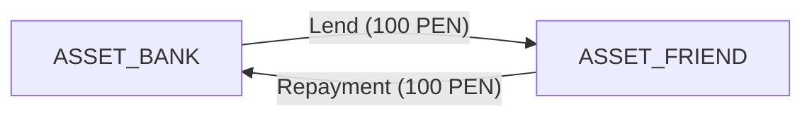
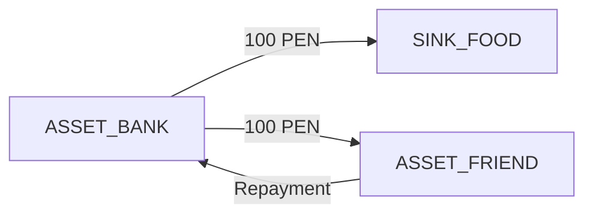
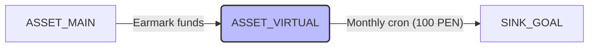

# Core logic

## Core Architecture & Philosophy

The system operates on three concentric layers designed to protect data immutability and isolate the complexity of external providers. The mathematical foundation is a directed graph $G = (V, E)$.

- **Layer 1 — Mathematical Core:** A closed environment that enforces the zero-sum principle and bitemporal auditability. Entities: `Node`, `Vector`.
- **Layer 2 — Domain Layer (and Reports):** Applies business rules, cross-cutting classification dictionaries, liquidity limits, automated jobs, and the **lineage-based netting engine** for reports. Entities: `Budget_Constraint`, `Tag_Registry`, `Automation_Rule`.
- **Layer 3 — Infrastructure Layer:** Abstracts physical reality and interacts with payment gateways, banks, and webhooks. Entities: `Account`, `Transaction`.

The financial transaction history is strictly **append-only**.

---

## Core Data Structures

### `Node`

Centralizes financial actors. Currency is immutable after creation. Behavior is governed entirely by node type.

- **`ASSET` (Real / Tangible):** Represents money under your control. Can be liquid (bank accounts) or illiquid/receivable (e.g. money lent to a friend).
- **`LIABILITY` (Virtual / Passive):** Represents debt. A negative balance means you owe; a positive balance means you are owed through a credit line.
- **`SOURCE` (Origin):** The "outside" from which money enters the system (e.g. Salary, Interest). Its global balance will always be negative.
- **`SINK` (Destination / Category):** The "outside" toward which money exits. Acts as a final expense category.

| Field       | Description                                          |
| :---------- | :--------------------------------------------------- |
| `id`        | Primary key.                                         |
| `user_id`   | Owner of the node.                                   |
| `name`      | Display name (e.g. `"Main Bank"`, `"Food"`, `"Salary"`). |
| `type`      | `ASSET`, `LIABILITY`, `SOURCE`, `SINK`.              |
| `currency`  | Immutable ISO 4217 code (e.g. `PEN`, `USD`).         |
| `is_active` | Boolean. Locks the node from future vectors if false. |

### `Vector`

The immutable mechanism for pure financial mutation. It only moves numbers. Its relationship to the physical layer is $0 \to 1$. Carries a lineage token for report consolidation.

| Field             | Description                                                                                              |
| :---------------- | :------------------------------------------------------------------------------------------------------- |
| `id`              | Primary key.                                                                                             |
| `lineage_token`   | **String/UUID. Pivot for the report engine.** Groups the original vector and all its corrective or fractioned vectors. |
| `transaction_id`  | (Nullable) FK to `Transaction`. `NULL` for pure logical correction vectors.                              |
| `source_node_id`  | Node where funds originate ($u$).                                                                        |
| `target_node_id`  | Node where funds arrive ($v$).                                                                           |
| `amount`          | Absolute value extracted from the source node ($a > 0$).                                                 |
| `exchange_rate`   | Multiplier to convert source to target currency. Default: `1.0`.                                         |
| `tags`            | JSON. Orthogonal context for the mutation without altering the graph (e.g. `{"event": "trip_arequipa"}`). |
| `effective_at`    | Logical time. Logical emission date. Used for budgets and balances.                                      |
| `system_at`       | Physical time. Real creation timestamp in the database. Used for auditing and correction lineage.        |

### `Tag_Registry`, `Budget_Constraint`, and `Automation_Rule`

These retain the same structure as the original specification. They serve orthogonal tagging, passive spending limits (strict or soft), and cron execution respectively.

---

## Infrastructure Data Structures

### `Account`

Abstracts the bank connection for reconciliation. Its relationship to the logical node is **Many-to-One ($N:1$)**.

| Field              | Description                                                                                                                                                                               |
| :----------------- | :---------------------------------------------------------------------------------------------------------------------------------------------------------------------------------------- |
| `id`               | Primary key.                                                                                                                                                                              |
| `node_id`          | FK to `Node`. Target logic node. (Supports $N:1$). *Business note: an `ASSET` node may optionally be mapped $1:1$ to a specific `SINK` budget to create dedicated virtual accounts.* |
| `provider_type`    | Enum (`APP`, `YAPE`, `BCP`, `MANUAL`).                                                                                                                                                    |
| `official_balance` | Decimal. Last known physical balance.                                                                                                                                                     |
| `fallback_sink_id` | FK to a `SINK` (e.g. Maintenance / Discrepancies).                                                                                                                                        |

### `Transaction`

The real-world event.

| Field          | Description                                                    |
| :------------- | :------------------------------------------------------------- |
| `id`           | Primary key.                                                   |
| `external_ref` | String. Bank code or idempotency token. Usually seeds the initial `lineage_token`. |
| `cleared_at`   | Physical confirmation timestamp.                               |

---

## Abstract Operations & Business Logic

The system strictly separates mathematical accounting (for balance reconciliation) from reporting logic (for user understanding).

### Pure Accounting: `EvaluateState(node_id, start_date, end_date)`

Calculates the dynamic balance by blindly processing all valid vectors. The bank's physical balance always matches the mathematical balance of this function, regardless of human categorization errors corrected afterward.

$$
\text{Balance}(v) = \sum_{e \in E_{\text{in}}(v)} \big( e.\text{amount} \times e.\text{exchange\_rate} \big) - \sum_{e \in E_{\text{out}}(v)} e.\text{amount}
$$

### Centralized Liquidity: `Safe-To-Spend`

Calculates the real available money by subtracting passive budget commitments from assets, clamping overdrafts to zero.

$$
\text{Free\_Liquidity}(X_i) = \text{Balance}(X_i) - \sum_{k=1}^{n} \max\!\left(0,\ \text{Limit}(\text{SINK}_k) - \text{Spent}(\text{SINK}_k)\right)
$$

### Report Logic: `ReportState(lineage_token)` — The Netting Engine

Answers "where did my money actually go?" by collapsing the money path via `lineage_token`. Intermediate correction vectors cancel each other out, revealing the true origin and final destination.

**Reduction Algorithm:**

1. Extract all vectors sharing the same `lineage_token`.
2. Sum inflows and outflows grouped by `node_id`.
3. Nodes with a net sum of zero disappear from the report (they were pass-through).
4. The report surfaces nodes with negative balances (real origins) and positive balances (final destinations).

---

## Use Case Flows

The design resolves requirements through combinations of the base architecture, without requiring case-specific code per edge case.

### Daily Operations and Reconciliation

**Paying from the app:** The interface inserts a `Transaction` (APP) → emits `Vector` $V_{\text{ASSET}} \to V_{\text{SINK}}$.

**Registering real accounts:** Create `Account` records linked to `ASSET` nodes. The $N:1$ rule prevents breaking the central pool.

**Balancing unregistered expenses / discrepancies:** Manual or assisted execution (balance assistant). If the physical `Account` balance is lower than `EvaluateState` of the `ASSET`, the system emits an automatic vector $V_{\text{ASSET}} \to V_{\text{SINK\_UNALLOCATED}}$ for the difference. The user later reclassifies it via a corrective vector (see Correcting Errors below).

**Fines (unbudgeted expenses):** Emit the vector directly toward `SINK_FINES`. Without an associated `Budget_Constraint` (or with one set to `is_strict = false` and limit 0), the expense is reflected in accounting and drains real liquidity without breaking system flow.

**Multi-currency support:** Natively supported in `Vector` via `exchange_rate`, with currency isolated per `Node`.

**Refunds (e.g. AirBnB reimbursement):** Do not use a `SOURCE`. A refund for a previously executed expense is an inverse vector: $V_{\text{SINK\_AIRBNB}} \to V_{\text{ASSET\_BANK}}$. Use the **same `lineage_token`** as the original transaction. The report engine will net the original expense against the refund, showing a net impact of 0 for the trip.

---

### Budgets and Automation

**Creating budgets:** Generate `Budget_Constraint` records associated with `SINK` nodes.

**Automating budget creation / cumulative budgets:** An `Automation_Rule` triggers a monthly cron. For regular budgets, it creates a new `Budget_Constraint` for the current month. For cumulative budgets, it runs `EvaluateState` on the previous month; the remainder ($\text{Limit} - \text{Spent}$) is injected as a delta into the `limit_amount` of the newly generated constraint.

**One-time annual payments exceeding a monthly budget:** Budgets are scoped by `start_date` and `end_date`. An annual expense may carry an annual-cycle budget, or the system permits a soft-limit overdraft that impacts global free liquidity without blocking the system.

---

### Special Cases, Derived Flows, and Deferred Times

**Managing loans to friends:**

The friend is modeled as an `ASSET_FRIEND` node (receivable account).

Lending money: $V_{\text{ASSET\_BANK}} \to V_{\text{ASSET\_FRIEND}}$. Your liquidity drops; your net worth is unchanged — no expense is recorded. Repayment reverses the flow.

**Late correction of budgets / past expenses:**

Emit corrective vectors. It is critical to distinguish the dates: `effective_at` is set to the real date of the past expense (e.g. one week ago), while `system_at` records the current physical moment of the correction. The engine recalculates historical budgets correctly based on `effective_at`.

**Correcting errors — the lineage engine in action:**

_Error:_ 100 PEN was categorized under Food instead of Education.

_Correction:_ A pure logical vector (`transaction_id = NULL`): $V_{\text{SINK\_FOOD}} \to V_{\text{SINK\_EDUCATION}}$ for 100 PEN.

This corrective vector carries the **same `lineage_token`** as the original. `EvaluateState` on the bank account remains intact (it only saw the original outflow). `ReportState` will show that the bank origin fed directly into Education, hiding the temporary pass through Food.

**Split payments / third-party funds:**

_Example:_ You pay 200 PEN — 100 yours for Food, 100 advanced for a friend's Education.

A single `lineage_token` spans both vectors. When the friend repays, emit $V_{\text{ASSET\_FRIEND}} \to V_{\text{ASSET\_BANK}}$. The cycle closes mathematically.

**Trips and orthogonal grouping (taxonomy):**

Expenses on food and transport in Arequipa emit vectors to `SINK_FOOD` and `SINK_TRANSPORT` respectively. All are injected with the tag `{"trip_id": "arequipa_2026"}`. The report engine can pivot by node (total spent on food overall) or by tag (total spent on the Arequipa trip). This avoids creating duplicate or temporary budget categories.

**Virtual account for a dedicated budget (suggestion):**

Create a logical `ASSET_VIRTUAL` node. Loading it with funds ($V_{\text{ASSET\_MAIN}} \to V_{\text{ASSET\_VIRTUAL}}$) allows the UI to enforce that all expenses originating from this virtual node are routed to a specific `SINK` or tag, physically isolating money assigned to that goal.

